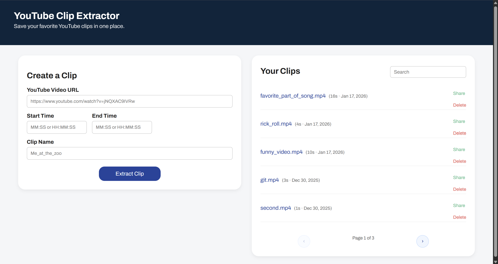
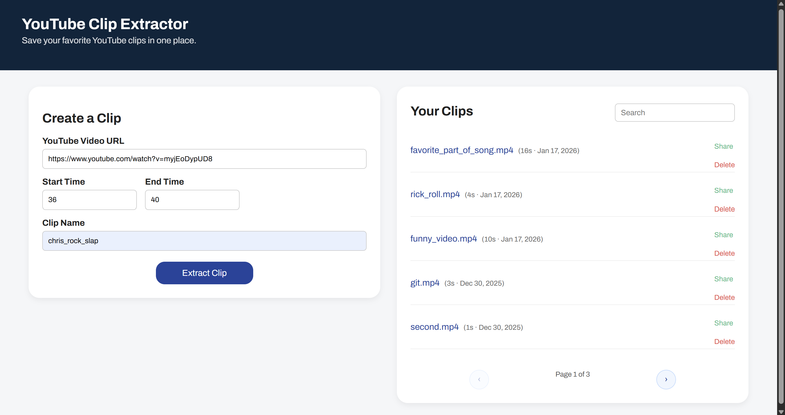
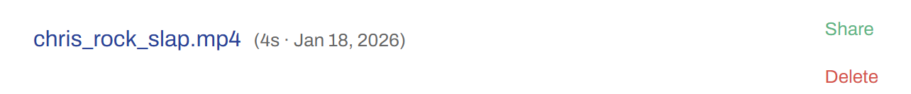

# YouTube Clipper

A simple web app for extracting short clips from YouTube videos.

Built as a lightweight, end-to-end tool to paste a YouTube link, choose timestamps, and generate downloadable clips.

---

## Demo

## Screenshots

  
   
  <em>See the clipper tool on the left and a list of your previous clips on the right.</em>

  
   
  <em>Paste a YouTube link and select clip range.</em>

  
   
  <em>Generated clip ready for download.</em>

---

## Tech Stack

- Frontend: HTML, CSS, JavaScript  
- Backend: Node.js, Express  
- Video Processing: `yt-dlp`, `ffmpeg`

---

## Features

- Paste a YouTube URL
- Select start/end timestamps
- Generate and download clips
- Fast, local processing

---

## Status

This project is actively being iterated on.  
README will be expanded with setup instructions, architecture, and design notes.

For now, this page serves as a visual showcase.
